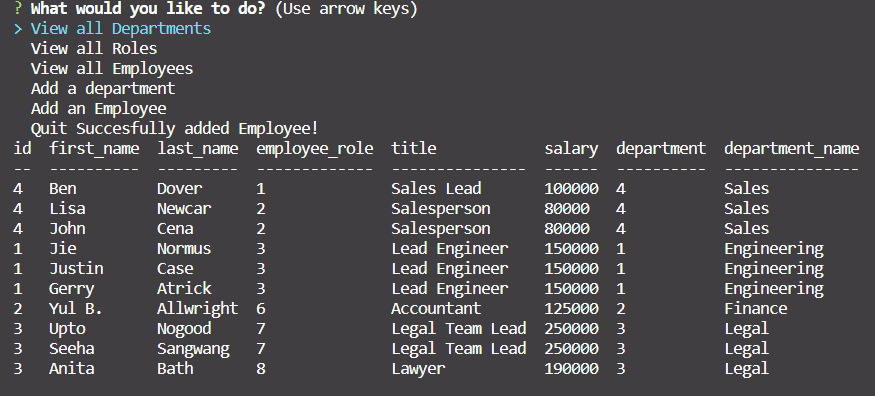

# Employee-Tracker

## Description 
This application was created for business owners who would want to view and manage their employees, roles, and departments.

## Installation 
To install the project, clone the repository into your local device and install all the necessary components with 'npm i'. Then from there, the user can run 'node.js' in their terminal.

## Usage 
This application is useful when trying to keep track of employees and where they are all working. See video on how to use application. 

https://pdx.cdn.nv.instructuremedia.com/originals/o-3LXnZGD17hECgikEFD7wgcpRKQQx1vig/transcodings/t-3M8za1VCBkxYcs6sevzWhbkFWrXVo4La.mp4?&Expires=1669265642&Signature=S2Mqz79uKlHeAnHRGVJlaf9tEJQnfdoaQ7Q2Da1HrNnFavg~XNK29YEWG2Gtjy26Dl8JKV-ALBLtLkCu2k2eNXDvub47~clZmkvk7ZZrJC3whSilC3-mJFo2LFtDVSXHzANYZK1af3WCJW1gezVyO~mbxVrewxI5fRxGVwKLAqAboNT9r7l6lIHtr8TdR2sibnVdTaMYxslk1mWHvXTps21aJeu2kSWmlA9SgWXfEdQhuYYDWUI5XVwlqX5m75UHYDDrnhA3NZYugysGoBr-xJribDvOYvwjzmvoWo1MgVodWzwCzJqUlxbifv14nPN8uawor3MbnJqeb~c9HJan7Q__&Key-Pair-Id=APKAJLP4NHW7VFATZNDQ

## Tests 
N/A
## Contributing 
N/A
## License
See Repository
## Questions
--GITHUB USERNAME--
ssangwang
--EMAIL--
ssangwang009@umn.edu